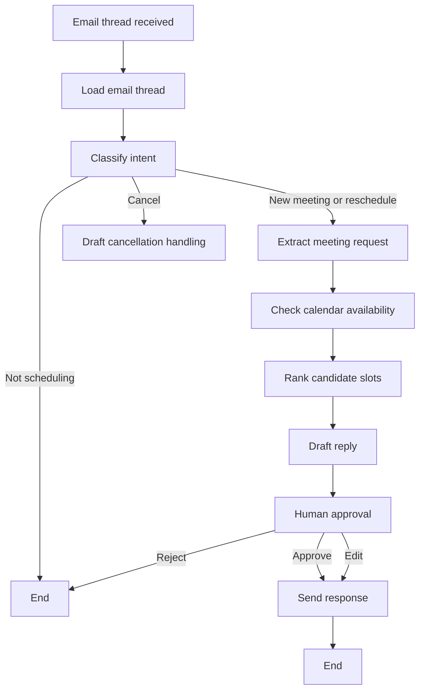

# Architecture

## Core Flow

## State

The graph uses a shared scheduling state with:

- `email_thread_id`
- `email_thread`
- `intent`
- `meeting_request`
- `busy_blocks`
- `candidate_slots`
- `selected_slot`
- `draft_reply`
- `approval`
- `calendar_event_id`
- `error`

## Integration Boundary

Real providers should implement the protocols in `src/meeting_scheduler_agent/tools.py`.

The graph does not need to know whether availability came from Google Calendar, Outlook, or a mock object. This keeps the orchestration stable while integrations change.

## Production Notes

- Store all candidate slot calculations in UTC.
- Render times in the organizer and attendee time zones when drafting emails.
- Use a durable checkpointer for long-running email threads.
- Require approval for any action that sends an email or mutates a calendar.
- Add idempotency keys around send/create/update operations to prevent duplicate invites.
- Persist thread-to-event mappings so reschedules and cancellations can find the right event.
